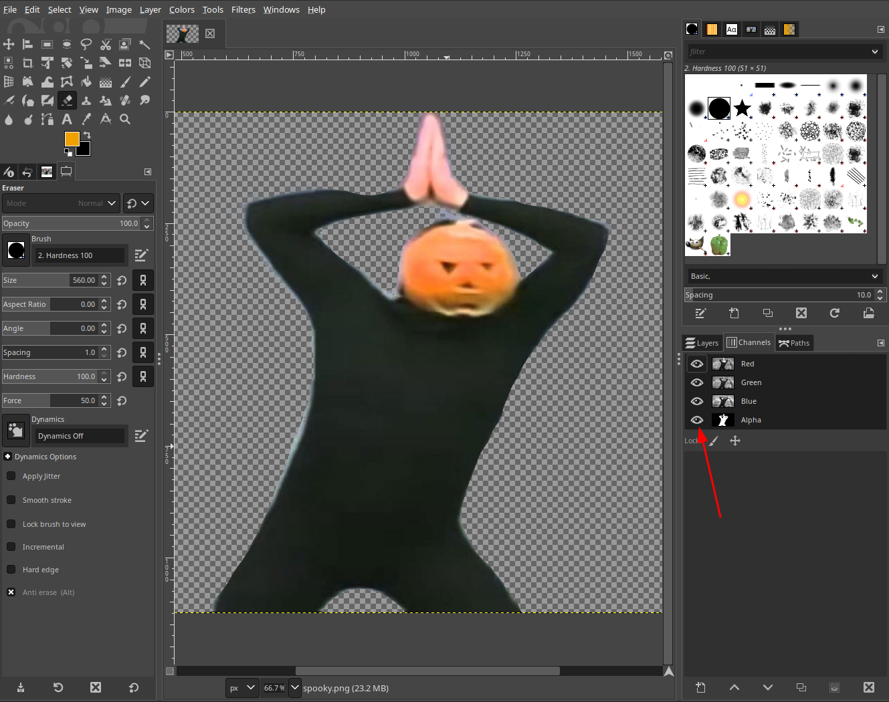

# Skeleton Wars
* **Event:** SpookyCTF
* **Problem Type:** Forensics
* **Point Value / Difficulty:**
* **(Optional) Tools Required / Used:**

## Steps
#### Step 1
When you open up the image, you'll see that it is mostly transparent, except for the pumpkin guy in the middle. The prompt mentions that I erased the background, so that's probably where you'll find the flag.

#### Step 2
Since this image is a PNG, it has an alpha (A) channel in addition to the traditional RGB channels. When you "erase" parts of a PNGs, you can save the file such that the RGB values of the erased pixels are still stored, they're just not rendered when you actually look at the PNG. This means that you can open the image in something like [GIMP](https://www.gimp.org/) and remove/turn off the alpha channel to restore the parts of the image that were erased.

*Click this button to turn off the alpha mask*

Once you've turned off the alpha channel, you should be able to see the entire image and get the flag: `utflag{spooky_scary_flag}`.

