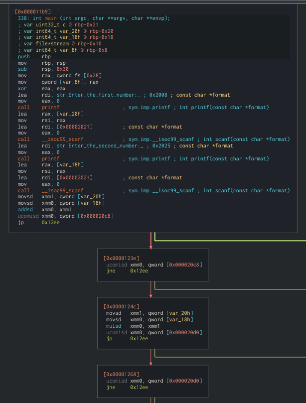
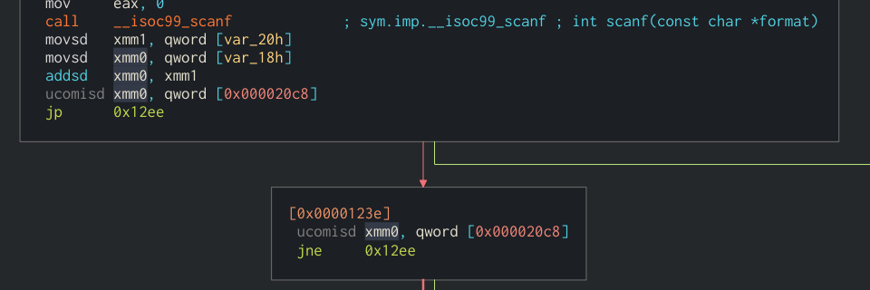

# Quick Maths
* **Event:** galacticBattleCTF
* **Problem Type:** Reversing
* **Point Value / Difficulty:** Easy
* **(Optional) Tools Required / Used:**

## Steps
#### Step 1
When you go to connect to the service, you will be asked for 2 numbers, with no other help. Luckily, we are provided with the compiled program, so we can try to reverse engineer that.

#### Step 2
If you open the binary in a disassembler (I like [Cutter](https://cutter.re/)) and look at the main function (there's not much else), you'll see this:

The first part we want to focus on is this snippet:

Here, it's taking in our two numbers and then adding them together and comparing it against `0x20c8 = 8392`. This means we want our two numbers to add to 
