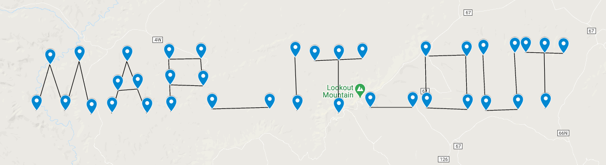

# Uncharted
* **Event:** ForeverCTF
* **Problem Type:**  Misc
* **Point Value / Difficulty:** Medium
* **(Optional) Tools Required / Used:**

## Steps
#### Step 1
The numbers in the file are `latitude, longitude` coordinates, where each of the different sections of coordinates corresponds to a letter in the flag.

#### Step 2
You can use a tool like [this](https://www.mapcustomizer.com/#) or [this](https://gpspointplotter.com/) to plot out the points. When you connect them, you should be able to read out the inside of the flag:

`utflag{map_it_out}`
