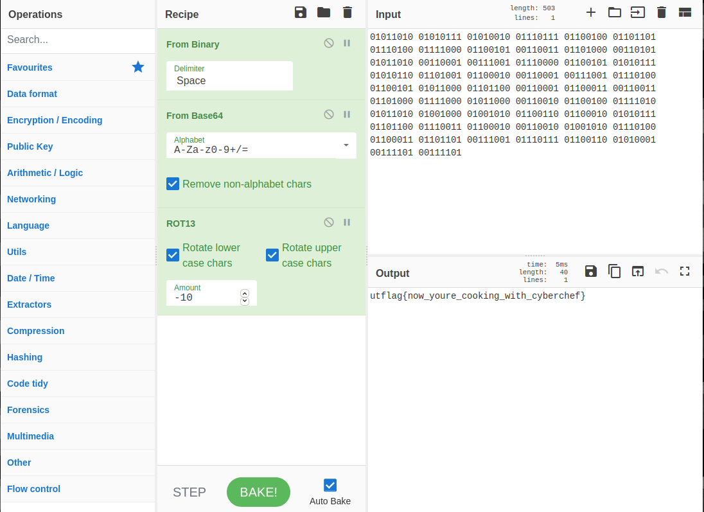

# Intro to CyberChef
* **Event:** ForeverCTF
* **Problem Type:** Tools
* **Point Value / Difficulty:** Easy
* **(Optional) Tools Required / Used:** CyberChef

## Steps
#### Step 1
Using CyberChef, your final recipe should look something like this:

It should spit out the flag `utflag{now_youre_cooking_with_cyberchef}`.
